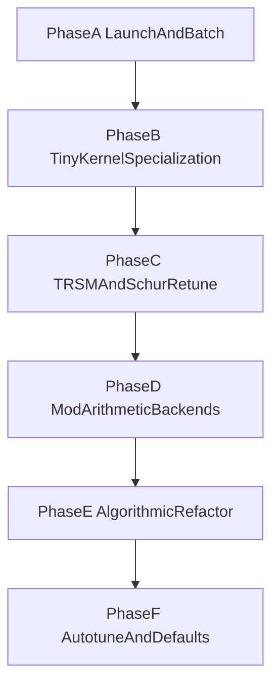

# CuModMatrix Inverse/PLUQ Optimization Roadmap

## Goals

- Reduce end-to-end runtime for `pluq_new`, `inverse_new`, `right_inverse_new`, and `left_inverse_new`.
- Improve both latency and throughput with explicit tiny-size batched kernels.
- Remove avoidable host-device synchronization.
- Add modular arithmetic backends that are selectable and benchmarked.
- Keep correctness strict over finite fields.

## Current Architecture

### Square PLUQ path

1. `pluq_new!` calls blocked recursion in `blocked_recursive_pluq.jl`.
2. Each recursive panel runs `pluq_basecase_gpu!`.
3. Then TRSM left/right panel kernels run.
4. Then Schur update tiled kernel runs.
5. Recurse on trailing block.

### Square inverse path

1. `inverse_new` builds augmented `[A | I]`.
2. For each pivot column:
   - find pivot,
   - swap,
   - normalize pivot row,
   - eliminate column.
3. Copy inverse block from augmented matrix.

### Rectangular right inverse path

1. `right_inverse_new` builds `[A | I_m]`.
2. For each step:
   - rectangular pivot search,
   - row/col swap,
   - pivot normalize,
   - elimination.
3. Scatter by column permutation.

## Bottleneck Inventory

### Launch overhead and synchronization

- Repeated per-step micro launches in basecase and augmented inversion loops.
- Per-step host scalar extraction (`Array(@view pivot_slot[1:1])`) in multiple paths.
- Rectangular path host pivot extraction from device matrix.

### Memory hierarchy issues

- Some hot kernels still stream from global memory in tight loops where shared/register staging can help.
- TRSM panel kernels are parallel by rows/cols but serial within each thread over panel depth.

### Arithmetic pressure

- Modular multiplication/reduction is used in every update inner loop.
- Current path is robust but not specialized by modulus/backend.

## Implemented Additions

### Tiny batched kernels (new)

- `pluq_batched_4x4!`, `pluq_batched_8x8!`, `pluq_batched_16x16!`, `pluq_batched_32x32!`
- `inverse_batched_4x4!`, `inverse_batched_8x8!`, `inverse_batched_16x16!`, `inverse_batched_32x32!`
- One block per matrix batch element for tiny square kernels.
- User-facing and exported.
- `pluq_new_batch` and `inverse_new_batch` now auto-dispatch to these tiny paths for homogeneous square batches of these sizes.

## Phase Plan

## Phase A: Launch Overhead and Proper Batching

### A1. Device-driven control flow

- Keep pivot metadata and pivot validity on-device through elimination loops.
- Replace host scalar reads with device slots consumed by follow-up kernels.
- Fuse pivot decode + swap where possible.

### A2. CUDA Graph capture for repeated loops

- Capture repeated launch chains for fixed-size inversion and reuse.
- Use graph execution for same shape/modulus batches.

### A3. True batched data layout

- Move from vector-of-matrices packing overhead toward persistent batch tensors.
- Maintain `(n, n, batch)` and `(m, w, batch)` buffers for repeated calls.

## Phase B: Thread Shuffle, Shared, Register Paths

### B1. Pivot reductions

- Extend ballot path with warp `shuffle_down` min-index reductions.
- Use warp-first, block-second reductions to reduce shared memory sync rounds.

### B2. Tiny specialization

- Keep tiny matrices in shared/register tiles.
- Unroll by static `Val{4,8,16,32}`.
- Prefer warp-synchronous sections for 4/8/16.

### B3. Schur micro-batching

- For many equal trailing tiles, batch same tile position across matrices.
- Evaluate tile shapes:
  - `32x32` for square trailing updates,
  - `16x16` baseline fallback,
  - `32x8` and `8x32` for rectangular trailing updates.

## Phase C: TRSM and Schur Throughput Retune

### C1. TRSM

- Use warp-cooperative solves for panel depth ranges where serial loops dominate.
- Add size thresholds to select:
  - panel kernel (current),
  - warp-cooperative small panel kernel.

### C2. Schur

- Parameterize tile size (`8/16/32`) and select by matrix regime and dtype.
- Evaluate transposed staging for one operand to improve access regularity.

## Phase D: Modular Arithmetic Backends

### D1. Backend candidates

- Baseline: current reduction.
- Barrett reduction for fixed modulus.
- Montgomery reduction for odd prime moduli.

### D2. Selection policy

- Backend chosen by modulus, dtype, and kernel family.
- Keep strict fallback path.

### D3. Lookup table guidance

- LUT is only useful for very small prime moduli and tiny kernels with high reuse.
- For medium/large kernels LUT usually loses due to memory bandwidth/footprint.

## Phase E: Algorithmic Upgrades

### E1. More complete lazy swap

- Current lazy permutation vector composition can be extended to reduce physical data swaps in tiny kernels.

### E2. Alternative inverse path

- Add optional PLUQ+triangular-solve inversion path for square matrices and compare against current augmented Gauss-Jordan.

### E3. Scheduling

- Overlap independent stages with streams where dependency graph allows.

## Phase F: Autotuning and Default Selection

- Tune `(blocksize, basecase, nftb)` by regime:
  - tiny (`<=32`),
  - small,
  - medium,
  - fivekish.
- Separate tuning for FP32 and FP64.
- Persist best config table for runtime dispatch.

## Matrix Shape/Bucket Strategy

### Tiny fixed buckets

- `4x4`, `8x8`, `16x16`, `32x32`: dedicated batched kernels.

### Nearby sizes

- Option A: fallback to general kernels.
- Option B: pad-to-next bucket with masks for highly batched workloads.

### Schur-specific shape guidance

- `64x64` trailing block:
  - split into four `32x32` updates,
  - batch same tile coordinate across matrix batch.
- Rectangular trailing blocks:
  - evaluate `32x8`, `8x32`, `16x16`.

## Benchmarking Plan

- Keep two benchmark modes:
  - latency mode (`batch_count=1`),
  - throughput mode (true batched path).
- Report GPU fastest vs Nemo with identical workload definitions.
- Add kernel-family timing splits:
  - pivot,
  - TRSM,
  - Schur,
  - full inversion.

## Validation Plan

- Add deterministic tiny-batch tests for each new user-facing kernel.
- Validate:
  - exact inverse identity on square tiny batches,
  - PLUQ identity reconstruction and rank,
  - failure behavior on singular matrices.
- Keep rectangular suite unchanged and add batched rectangular experiments after square tiny baseline stabilizes.

## Risk Controls

- Gate advanced kernels behind options until benchmark wins are stable.
- Verify correctness across multiple primes (`7`, `11`, `101`) and both FP32/FP64.
- Monitor occupancy and register pressure before promoting larger tile defaults.
