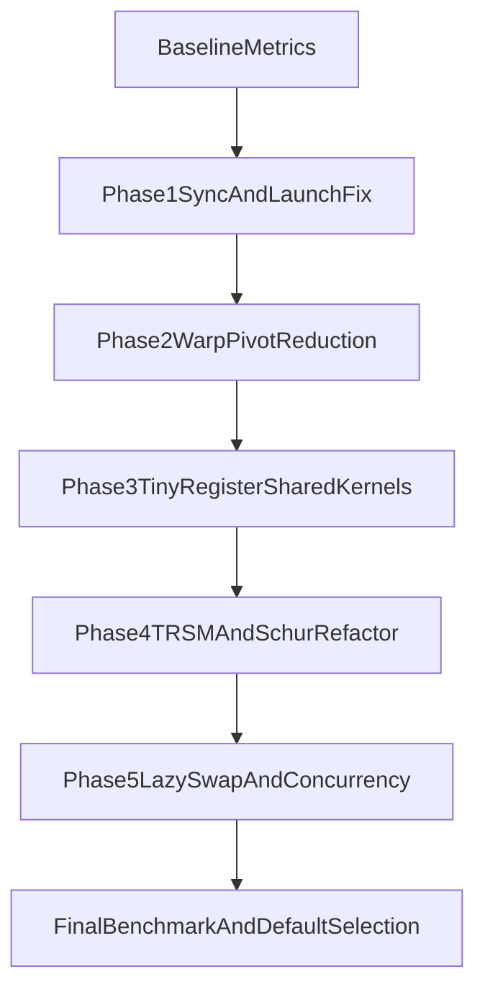

## Performance-Only Optimization Plan (Second Pass)

Built from the current implementation in [`api.jl`](/home/ryanyb/GPUFiniteFieldMatrices.jl/src/CuModMatrix/inverse/api.jl), [`basecase_pluq.jl`](/home/ryanyb/GPUFiniteFieldMatrices.jl/src/CuModMatrix/inverse/basecase_pluq.jl), [`trsm.jl`](/home/ryanyb/GPUFiniteFieldMatrices.jl/src/CuModMatrix/inverse/trsm.jl), [`schur_update.jl`](/home/ryanyb/GPUFiniteFieldMatrices.jl/src/CuModMatrix/inverse/schur_update.jl), [`rectangular_pluq.jl`](/home/ryanyb/GPUFiniteFieldMatrices.jl/src/CuModMatrix/inverse/rectangular_pluq.jl), benchmark harness in [`inv_benchmark.jl`](/home/ryanyb/GPUFiniteFieldMatrices.jl/test/Experiments/inv_benchmark.jl), and ICCS techniques.

### Current bottlenecks to target first

- Host-device synchronization in hot loops (`Array(@view ...)` for pivot row/pivot value) in `inverse_new`, basecase PLUQ, rectangular path.
- Pivot kernels use atomic min into one slot; contention rises with matrix size.
- TRSM launches one kernel per panel row/column with serial inner loops.
- Schur update materializes multiple temporary blocks and writes back, increasing memory traffic.
- No register/shared-memory tiny-matrix microkernel yet (ICCS’s biggest small-size gain lever).
- No lazy-swap realization yet (`lazy_q` exists in options but is not used in kernels).

---

## Plan of attack (phased)

### Phase 0: Measurement hardening (must-do before changes)

1. Extend [`inv_benchmark.jl`](/home/ryanyb/GPUFiniteFieldMatrices.jl/test/Experiments/inv_benchmark.jl):
   - fixed RNG seed option for reproducibility
   - optional per-phase timers (`pivot`, `swap`, `scale`, `elim`, `trsm`, `schur`)
   - standardized warmup and trial medians
2. Define target matrix suites:
   - tiny: 4..32
   - small: 48..128
   - medium: 256..1024
3. Keep correctness checks enabled at least every Nth run.

Success criterion: stable baseline variance (<5-10% at same config).

---

### Phase 1: Remove avoidable synchronization and launch overhead

1. Replace host scalar extraction patterns in:
   - [`basecase_pluq.jl`](/home/ryanyb/GPUFiniteFieldMatrices.jl/src/CuModMatrix/inverse/basecase_pluq.jl)
   - [`api.jl`](/home/ryanyb/GPUFiniteFieldMatrices.jl/src/CuModMatrix/inverse/api.jl)
   - [`trsm.jl`](/home/ryanyb/GPUFiniteFieldMatrices.jl/src/CuModMatrix/inverse/trsm.jl)
2. Keep pivot metadata on device as much as possible, minimizing device->host scalar pulls to control-flow boundaries only.
3. Fuse trivial setup kernels when possible (e.g., slot reset + pivot scan path).

Expected impact: high for `inverse_new` and rectangular paths.

---

### Phase 2: ICCS-style pivot optimization with warp primitives

1. Rework pivot search kernels in:
   - [`basecase_pluq.jl`](/home/ryanyb/GPUFiniteFieldMatrices.jl/src/CuModMatrix/inverse/basecase_pluq.jl)
   - [`rectangular_pluq.jl`](/home/ryanyb/GPUFiniteFieldMatrices.jl/src/CuModMatrix/inverse/rectangular_pluq.jl)
   - augmented pivot in [`api.jl`](/home/ryanyb/GPUFiniteFieldMatrices.jl/src/CuModMatrix/inverse/api.jl)
2. Replace “many-thread atomic min” with hierarchical reduction:
   - warp-level candidate reduction (shuffle/vote)
   - block-level reduction
   - one atomic per block (or final reduction kernel)
3. Keep finite-field “first nonzero” semantics unchanged.

Expected impact: high where pivoting dominates.

---

### Phase 3: Register/shared-memory tiny-kernel path (ICCS core technique)

1. Add specialized microkernels for very small panels (e.g. 8/16/32):
   - one TB handles one matrix panel
   - matrix tile loaded once into fast memory
   - unrolled elimination loops
2. Compare two variants:
   - register-centric (`one row per lane/thread`)
   - shared-memory tile variant
3. Auto-select based on panel size and type (`Float32` vs `Float64`).

Target files:

- [`basecase_pluq.jl`](/home/ryanyb/GPUFiniteFieldMatrices.jl/src/CuModMatrix/inverse/basecase_pluq.jl)
- [`types.jl`](/home/ryanyb/GPUFiniteFieldMatrices.jl/src/CuModMatrix/inverse/types.jl) (new tuning knobs)

Expected impact: very high for tiny/small matrices (the ICCS sweet spot).

---

### Phase 4: TRSM and Schur throughput refactor

1. TRSM:
   - replace per-row/per-column launch loop with panel/tiled kernels
   - improve parallelism and reduce launch count
   - cache panel data in shared memory when beneficial
2. Schur:
   - avoid materializing extra full temporary blocks where possible
   - move toward in-place tiled update using existing GEMM kernels or fused update path

Target files:

- [`trsm.jl`](/home/ryanyb/GPUFiniteFieldMatrices.jl/src/CuModMatrix/inverse/trsm.jl)
- [`schur_update.jl`](/home/ryanyb/GPUFiniteFieldMatrices.jl/src/CuModMatrix/inverse/schur_update.jl)

Expected impact: high on medium+ sizes.

---

### Phase 5: Lazy swap and tunable concurrency

Status: implemented (initial production pass).

1. Implement practical lazy swap strategy:
   - delay row/column materialization
   - maintain local mapping vectors during factorization
   - materialize once at block boundary
2. Activate and use `lazy_q` behavior end-to-end.
3. Introduce ICCS-like tunable concurrency (`nFTB`-style concept):
   - allow one TB to process multiple tiny matrices when occupancy is low
   - tune by size range.

Target files:

- [`basecase_pluq.jl`](/home/ryanyb/GPUFiniteFieldMatrices.jl/src/CuModMatrix/inverse/basecase_pluq.jl)
- [`rectangular_pluq.jl`](/home/ryanyb/GPUFiniteFieldMatrices.jl/src/CuModMatrix/inverse/rectangular_pluq.jl)
- [`types.jl`](/home/ryanyb/GPUFiniteFieldMatrices.jl/src/CuModMatrix/inverse/types.jl)

Expected impact: medium-high for batched tiny matrices; medium for larger sizes.

Implemented details:

- `lazy_q` now performs local permutation accumulation in basecase and composes once per segment.
- Added tunable `nftb` in `PLUQOptions` and wired it to basecase thread selection.
- Added batched API entry points (`inverse_new_batch`, `pluq_new_batch`) to support low-overhead multi-matrix timing and execution flows.
- Added `run_phase5_benchmark()` in experiments for direct Phase4→Phase5 speedup export.

---

## Execution order and risk control

- Implement phases in order, benchmarking after each phase.
- Keep correctness guardrails:
  - existing inverse tests
  - rectangular tests
  - identity/rank checks
- Gate advanced kernels behind options first, then promote defaults only after benchmark wins.

---

## Kernel optimization flow

## What this should deliver

- Faster tiny/small matrix factorization/inversion (ICCS-aligned).
- Better scaling from reduced sync and launch overhead.
- Cleaner path to future autotuning without destabilizing correctness.

If you want, next I can break this into an implementation checklist with exact function-by-function edits for Phase 1 only (small, low-risk first).
